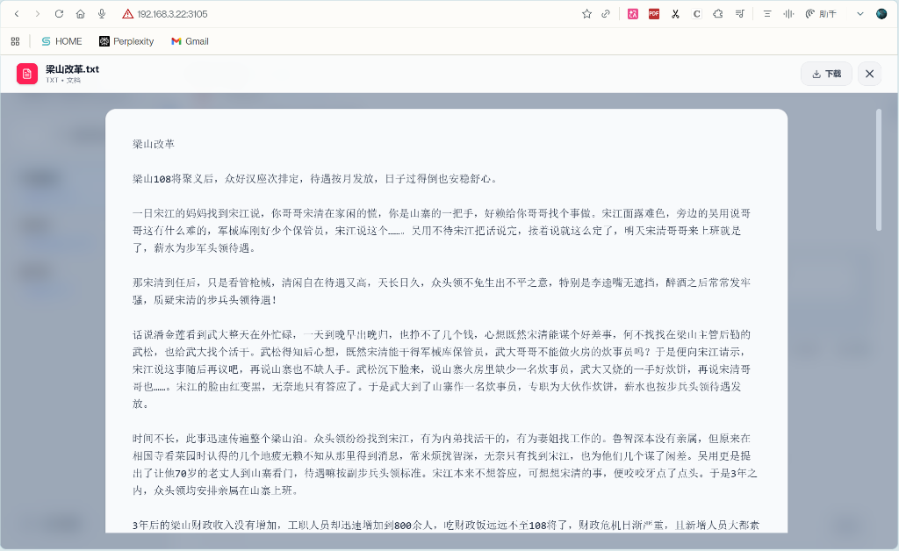
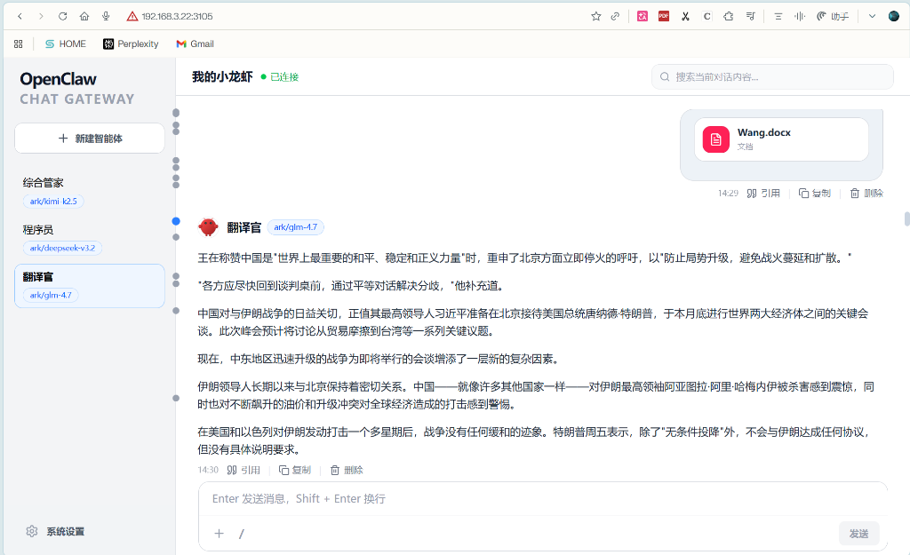

<p align="center">
  
</p>

# OpenClaw Chat Gateway

**现代化、生产级的 OpenClaw 全功能 Web 客户端**

[简体中文](#简体中文) | [English](#english)

---

## 简体中文

**OpenClaw Chat Gateway** 是一款专为 OpenClaw 生态打造的生产级 Web 客户端。它为高级用户提供了一套完整的“智能体沙盒”管理方案，结合极致的响应式界面，让您的 OpenClaw 体验步入全新次元。

### 🌟 核心亮点

- **🤖 多智能体，全 UI 界面配置**：支持多智能体快速创建与管理，通过全 UI 可视化界面完成所有配置逻辑。彻底**告别手动修改 JSON 和 Markdown 文件**。
- **📉 独立模型配置 & 极大节约 Token**：每个智能体可独立配置不同的模型，结合完全隔离的工作空间（Workspace）和独立配置文件，**精准控制模型分流，极大减少了由于背景重叠导致的 Token 浪费**。
- **📱 极致的手机移动端优化**：深度适配移动端屏幕与交互逻辑，响应式设计丝滑顺畅，**操作体验几乎与原生 APP 无异**。

### ✨ 深度功能
- **🗝️ 智能体完全隔离 (Sandboxing)**：独立工作区、独立记忆。每个角色拥有专属的 `SOUL.md` 和 `USER.md`，彻底告别对话污染。
- **🖼️ 工业级预览体验**：集成 LibreOffice 渲染能力，完美支持 Word, PPT, Excel, PDF 等复杂文档在线预览，还原真实排版。
- **🚀 深度原生集成**：在对话窗口直接运行 `/status`、`/help` 等底层指令，实时反馈系统状态。

<p align="center">
  
  
</p>

### 🚀 快速开始
> [!IMPORTANT]
> 本项目须安装在安装了 OpenClaw 的 **Linux 主机**上，且必须是 **原生安装**（非 Docker）。

#### 📥 一键安装
```bash
# 默认端口 3115
curl -fsSL https://raw.githubusercontent.com/liandu2024/OpenClaw-Chat-Gateway/main/install.sh | bash

# 自定义端口部署 (例如 8080)
curl -fsSL https://raw.githubusercontent.com/liandu2024/OpenClaw-Chat-Gateway/main/install.sh | bash -s 8080
```

#### 🆙 无损升级 / 🗑️ 彻底卸载
```bash
# 无损升级
curl -fsSL https://raw.githubusercontent.com/liandu2024/OpenClaw-Chat-Gateway/main/update.sh | bash

# 彻底卸载
curl -fsSL https://raw.githubusercontent.com/liandu2024/OpenClaw-Chat-Gateway/main/uninstall.sh | bash
```

---

### 📱 移动端预览
精心打磨的移动端细节，不仅是响应式，更是沉浸式。

<p align="center">
  
  
</p>

---

### 💡 提示：预览增强
如果您需要预览 Word, PPT, Excel 等文档，请运行以下指令安装 LibreOffice：
```bash
sudo apt update && sudo apt install libreoffice -y
```

### 💬 社群与支持
- **Telegram 群**: [安格视界 (AngeWorld)](https://t.me/angeworld2024)
- **资源站**: [安格超市 (Ange Market)](https://blog.angeworld.cc/market/)
- **AI 接口**: [芝麻开门 AI 接口](https://ai.opendoor.cn)

---

## English

**OpenClaw Chat Gateway** is a modern, enterprise-grade web client for the OpenClaw ecosystem. It provides professional "Agent Sandboxing" and a silky-smooth responsive UI, taking your OpenClaw productivity to the next level.

### 🌟 Why Choose Chat Gateway?

- **🗝️ Full UI Configuration**: Manage multiple agents effortlessly through a clean visual interface. **No more manual JSON/Markdown editing**.
- **📉 Isolated Models & Token Savings**: Configure specific models for each agent. Combined with isolated workspaces, it **minimizes context overlap and significantly reduces token consumption**.
- **📱 Mobile Excellence**: A mobile-first responsive design that feels and behaves like a **native iOS/Android app**.
- **🖼️ High-Fidelity Previews**: Built-in support for Word, PPT, Excel, and PDF previews using LibreOffice rendering for professional accuracy.

### 🚀 Quick Start
```bash
# Default installation
curl -fsSL https://raw.githubusercontent.com/liandu2024/OpenClaw-Chat-Gateway/main/install.sh | bash

# Custom port
curl -fsSL https://raw.githubusercontent.com/liandu2024/OpenClaw-Chat-Gateway/main/install.sh | bash -s 8080
```
