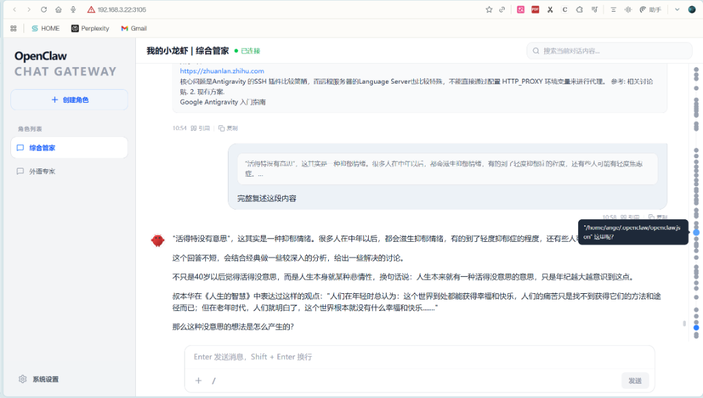

# OpenClaw Chat Gateway

[English](#english) | [简体中文](#简体中文)



---

## English

**OpenClaw Chat Gateway** is a modern, feature-rich web client designed specifically for the OpenClaw ecosystem. It provides a premium chat experience with robust session management and system-level deployment.

### ✨ Key Features

- **🚀 Direct OpenClaw Communication**: Full replacement for external chat tools (like Telegram). Connect directly to your OpenClaw instance for seamless interaction.
- **🤖 Native Command Support**: Support for all native OpenClaw commands (e.g., `/status`, `/help`) directly in the chat interface.
- **📱 Perfect Mobile Experience**: Fully optimized responsive design for seamless interaction on smartphones and tablets.
- **📁 Shared Workspace Integration**: Support for shared workspace folders with OpenClaw, ensuring uploaded files are immediately readable by AI.
- **⚡ Custom Quick Commands**: Define and manage your own shortcut commands for frequently used tasks to maximize efficiency.
- **📸 Comprehensive Chat Experience**:
  - Full **Markdown** support for rich text, code snippets, and structured data.
  - Multi-line input with automatic expansion for better writing.
  - Drag-and-drop support for **images, documents, and videos**.
  - Telegram-style image previews and global message search.
  - **Message Management**: Delete individual messages with high-quality custom confirmation modals.
  - **Conversation Flow**: Intelligent date dividers for multi-day conversations.
- **📁 Advanced Session Management**: Create, rename, and **drag-and-order** character sessions in the sidebar.
- **🛡️ Secure Access Control**:
  - **Login Password Protection**: Optional password gate to secure your gateway access.
  - **Reverse Proxy Whitelist**: Support for domain whitelisting to ensure secure deployment behind reverse proxies (Nginx/Traefik).
- **⚙️ Enterprise-Ready Deployment**:
  - One-click installation with automatic dependency resolution.
  - Native `systemd` integration for auto-start and background management.
  - Isolated database and file storage for maximum data integrity.

### 🛠️ Tech Stack

- **Full Stack**: Node.js, Express, React, Vite, Framer Motion.
- **Database**: Better-SQLite3.

### 📥 One-Click Installation

> [!IMPORTANT]
> To ensure a complete and seamless experience, this program must be installed on the same **Linux host** as OpenClaw, and it must be a **native installation** (not deployed via Docker).

The easiest way to install OpenClaw Chat Gateway is using the one-click installer:

```bash
curl -fsSL https://raw.githubusercontent.com/liandu2024/OpenClaw-Chat-Gateway/main/install.sh | bash
```

*By default, the service uses port **3115**. You can pass a custom port to the script:*

```bash
curl -fsSL https://raw.githubusercontent.com/liandu2024/OpenClaw-Chat-Gateway/main/install.sh | bash -s 8080
```

### 🆙 Update / Upgrade

To update to the latest version while preserving your existing port, configuration, and data:

```bash
curl -fsSL https://raw.githubusercontent.com/liandu2024/OpenClaw-Chat-Gateway/main/update.sh | bash
```

*The update script will automatically detect your currently running port and perform a non-destructive upgrade.*

### 🗑️ Uninstallation

To completely remove the project, including all settings and data:

```bash
curl -fsSL https://raw.githubusercontent.com/liandu2024/OpenClaw-Chat-Gateway/main/uninstall.sh | bash
```


### 💬 Community & Support

- **Official Telegram Group**: [AngeWorld (安格视界)](https://t.me/angeworld2024)
- **Ange Market**: [Explore Premium Assets](https://blog.angeworld.cc/market/)

---

## 简体中文

**OpenClaw Chat Gateway** 是一款为 OpenClaw 生态系统打造的现代化、功能丰富的 Web 客户端。它提供极致的聊天体验、强大的会话管理及系统级自动部署功能。

### ✨ 核心功能

- **🚀 直连 OpenClaw 通信**：完全取代 TG 等第三方聊天工具。直接与您的 OpenClaw 实例连接，实现无缝沟通。
- **🤖 原生指令支持**：支持所有 OpenClaw 原生指令（如 `/status`、`/help`），直接在对话框输入即可。
- **📱 完美的手机移动端体验**：深度优化的响应式设计，在手机和平板电脑上也能获得极致的交互体验。
- **📁 工作区深度共享**：支持与 OpenClaw 共享工作文件夹，确保上传的文件能被 AI 直接读取识别。
- **⚡ 自定义快捷指令**：自由定义和管理您的专属快捷指令，大幅提升日常操作效率。
- **📸 完整聊天体验**：
  - 完美支持 **Markdown** 格式，包括代码高亮、表格及富文本。
  - 多行输入框，随内容自动调整高度，丝滑输入。
  - 支持 **图片、文档、视频** 的拖拽发送。
  - 类 Telegram 的图片预览系统及全局消息搜索。
  - **消息管理**：支持单条消息删除，配备高颜值的自定义确认弹窗。
  - **对话流优化**：自动插入跨天日期分割线，聊天脉络更清晰。
- **📁 高级会话管理**：创建并管理多个角色会话，侧边栏支持**拖拽排序**。
- **🛡️ 安全访问控制**：
  - **安全登录密码**：可选的密码验证机制，全面保护您的网关访问安全。
  - **反向代理域名白名单**：支持域名白名单验证，适配 Nginx/Traefik 等反向代理环境的安全部署。
- **⚙️ 生产级部署方案**：
  - 一键式安装脚本，自动处理所有依赖。
  - 原生 `systemd` 集成，开机自启，后台稳定运行。
  - 独立的数据库与文件存储，确保数据安全隔离。

### 🛠️ 技术栈

- **全栈**：Node.js, Express, React, Vite, Framer Motion.
- **数据库**：Better-SQLite3.

### 📥 一键安装

> [!IMPORTANT]
> 为了获得完整且无缝的体验，本项目须安装在安装了 OpenClaw 的 **Linux 主机**上，且必须是 **原生安装**（而非 Docker 模式部署）。

最简单的安装方式是使用一键安装脚本：

```bash
curl -fsSL https://raw.githubusercontent.com/liandu2024/OpenClaw-Chat-Gateway/main/install.sh | bash
```

*默认服务端口为 **3115**。您可以通过参数自定义端口：*

```bash
curl -fsSL https://raw.githubusercontent.com/liandu2024/OpenClaw-Chat-Gateway/main/install.sh | bash -s 8080
```

### 🆙 升级与更新

如果您需要更新到最新版本，且希望**保留当前的端口、配置及数据库数据**，请运行：

```bash
curl -fsSL https://raw.githubusercontent.com/liandu2024/OpenClaw-Chat-Gateway/main/update.sh | bash
```

*该脚本会自动检测您当前正在运行的端口，并执行无损升级。*

### 🗑️ 卸载

如果您需要彻底删除本项目及其所有设置与数据，请运行：

```bash
curl -fsSL https://raw.githubusercontent.com/liandu2024/OpenClaw-Chat-Gateway/main/uninstall.sh | bash
```


### 💬 社群与支持

- **官方 TG 交流群**：[安格视界 (AngeWorld)](https://t.me/angeworld2024)
- **安格超市**：[获取更多精品资源](https://blog.angeworld.cc/market/)

